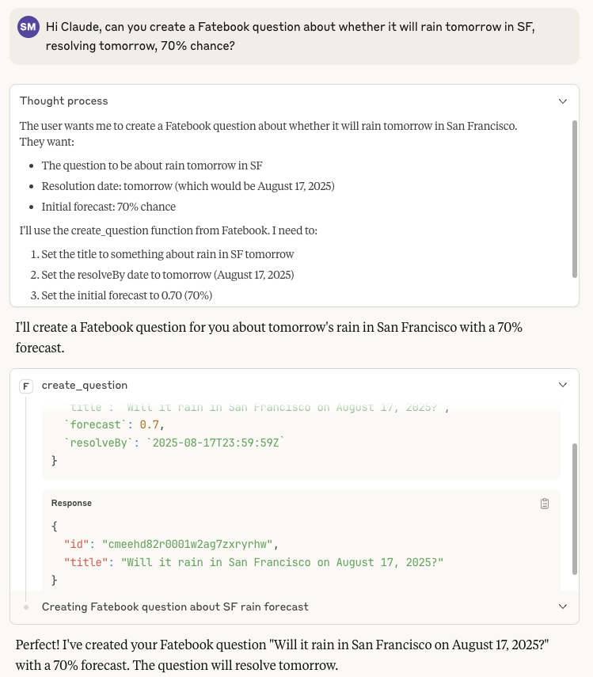
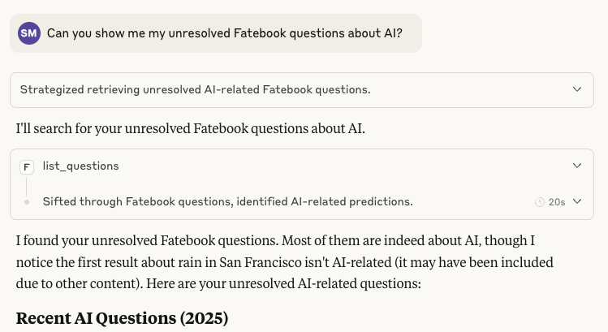
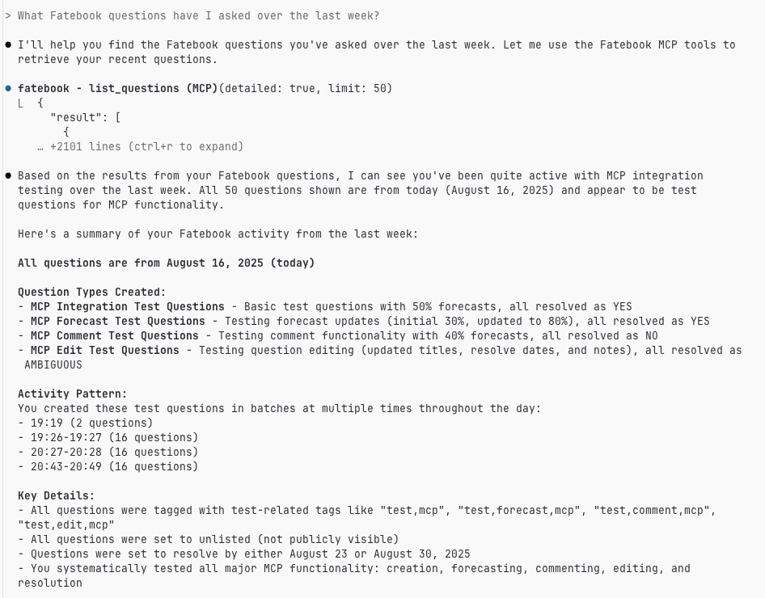

# Fatebook MCP Server

[](https://badge.fury.io/py/fatebook-mcp) [](https://www.python.org/downloads/) [](https://github.com/an1lam/fatebook-mcp/actions/workflows/ci.yml)

A Model Context Protocol (MCP) server that provides integration with [Fatebook](https://fatebook.io), a prediction tracking platform. This server allows AI assistants like Claude to create, manage, and track predictions directly through MCP.

<a href="https://glama.ai/mcp/servers/@an1lam/fatebook-mcp">
  
</a>

## Features

- **Create Questions**: Make predictions with forecasts (0-100% probability)
- **List Questions**: View your predictions with filtering options
- **Get Question Details**: Retrieve comprehensive information about specific questions
- **Add Forecasts**: Update your predicted probabilities on existing questions
- **Add Comments**: Add commentary to track your reasoning
- **Resolve Questions**: Mark questions as resolved (YES/NO/AMBIGUOUS)
- **Edit Questions**: Update question titles, resolve dates, and notes
- **Delete Questions**: Remove questions you no longer need
- **Count Forecasts**: Track your forecasting activity

## Testing and Compatibility

This MCP server has been tested on Mac OS X 14.5 with:

- Claude Code (CLI)
- Claude Desktop
- MCP Inspector

As far as I know, it doesn't violate any MCP protocol requirements but given that MCP is an evolving protocol, certain features or MCP clients may not be fully supported. If you encounter issues with other MCP implementations, please report them as GitHub issues.

## Installation

### Prerequisites

- Python 3.13 or higher
- [uv](https://github.com/astral-sh/uv) (recommended) or pip
- A Fatebook account and API key

### Getting your Fatebook API Key

1. Sign in to [Fatebook](https://fatebook.io)
2. Navigate to [API Setup](https://fatebook.io/api-setup)
3. Generate and copy your API key

### Option 1: Install from PyPI (Recommended)

Install the package directly from PyPI:

```bash
pip install fatebook-mcp
```

Or using uv:

```bash
uv add fatebook-mcp
```

### Option 2: Install from Source

For development or the latest features:

1. Clone the repository:

```bash
git clone https://github.com/an1lam/fatebook-mcp.git
cd fatebook-mcp
```

2. Install dependencies using uv:

```bash
uv sync
```

## Quick Start

### Running Directly with uvx

The easiest way to test the server after installation is with uvx:

```bash
# Run directly from PyPI (no installation needed)
uvx fatebook-mcp

# Or run from local directory during development
uvx --from . fatebook-mcp
```

The server will start and wait for MCP client connections via stdio. Use Ctrl+C to stop it.

## Usage with Claude Desktop and [Claude Code](https://www.anthropic.com/claude-code)

### Claude Desktop

Add one of the following configurations to your Claude Desktop configuration file:

#### macOS
Location: `~/Library/Application Support/Claude/claude_desktop_config.json`

#### Windows
Location: `%APPDATA%\Claude\claude_desktop_config.json`

#### Option 1: Using PyPI Package (Recommended)

```json
{
  "mcpServers": {
    "fatebook": {
      "command": "uvx",
      "args": ["fatebook-mcp"],
      "env": {
        "FATEBOOK_API_KEY": "your-api-key-here"
      }
    }
  }
}
```

**Note**: If Claude Desktop can't find `uvx`, use the full path instead:
```json
{
  "mcpServers": {
    "fatebook": {
      "command": "/Users/yourusername/.local/bin/uvx",
      "args": ["fatebook-mcp"],
      "env": {
        "FATEBOOK_API_KEY": "your-api-key-here"
      }
    }
  }
}
```

Find your uvx path with: `which uvx`

#### Option 2: Development/Source Installation

```json
{
  "mcpServers": {
    "fatebook": {
      "command": "uv",
      "args": [
        "--directory",
        "/path/to/fatebook-mcp",
        "run",
        "python",
        "-m",
        "fatebook_mcp"
      ],
      "env": {
        "FATEBOOK_API_KEY": "your-api-key-here"
      }
    }
  }
}
```

Replace `/path/to/fatebook-mcp` with the actual path to where you cloned this repository.

### Claude Code (CLI)

For Claude Code, you can add this server in several ways:

#### Option 1: Using PyPI Package (Recommended)

```bash
# Add the Fatebook MCP server using uvx
claude mcp add fatebook --env FATEBOOK_API_KEY=your-api-key-here -- uvx fatebook-mcp

# Verify it was added successfully
claude mcp list
```

#### Option 2: Import from Claude Desktop

If you already have this configured in Claude Desktop, you can import those settings:

```bash
claude mcp add-from-claude-desktop
```

#### Option 3: Project-specific configuration

Create a `.mcp.json` file in your project:

**Using PyPI package:**
```json
{
  "mcpServers": {
    "fatebook": {
      "command": "uvx",
      "args": ["fatebook-mcp"],
      "env": {
        "FATEBOOK_API_KEY": "your-api-key-here"
      }
    }
  }
}
```

If `uvx` is not found, use the full path (find with `which uvx`):
```json
{
  "mcpServers": {
    "fatebook": {
      "command": "/Users/yourusername/.local/bin/uvx",
      "args": ["fatebook-mcp"],
      "env": {
        "FATEBOOK_API_KEY": "your-api-key-here"
      }
    }
  }
}
```

**Using development/source installation:**
```json
{
  "mcpServers": {
    "fatebook": {
      "command": "uv",
      "args": ["--directory", "/path/to/fatebook-mcp", "run", "python", "-m", "fatebook_mcp"],
      "env": {
        "FATEBOOK_API_KEY": "your-api-key-here"
      }
    }
  }
}
```

Replace `/path/to/fatebook-mcp` with the actual path to where you cloned this repository.


## Development & Testing
### Additional setup
Beyond the above setup that's needed even just to use the MCP server, running the MCP server as standalone and running its tests require fetching your API key and exporting it in your environment.

You can do this either by exporting it directly:

```bash
export FATEBOOK_API_KEY="your-api-key-here"
```

Or create a `.env` file:

```
FATEBOOK_API_KEY=your-api-key-here
```

### Running integration tests

Run the integration tests to verify your setup:

```bash
uv run pytest test_client.py
```

This will test all available endpoints and confirm the server is working correctly.

**Note**: These tests will only succeed if you have the right API key for the test user. If you're developing such that you need to run these tests, for now email me (the author).

### Running the Server Locally

**Using uvx (recommended):**
```bash
uvx --from . fatebook-mcp
```

**Using uv run with module:**
```bash
uv run python -m fatebook_mcp
```

The server will start and wait for MCP client connections.

## Testing and Compatibility

This MCP server has been tested with:

- Claude Code (CLI)
- Claude Desktop
- MCP Inspector

As MCP is an evolving protocol, certain features or MCP clients may not be fully supported. If you encounter issues with other MCP implementations, please report them as GitHub issues.

## Troubleshooting

### uvx Command Not Found

If Claude Desktop shows "command not found" errors for `uvx`:

1. **Find your uvx path**:
   ```bash
   which uvx
   ```

2. **Use the full path** in your configuration:
   ```json
   "command": "/Users/yourusername/.local/bin/uvx"
   ```

3. **Common uvx locations**:
   - macOS: `/Users/yourusername/.local/bin/uvx`
   - Linux: `/home/yourusername/.local/bin/uvx`

### API Key Issues

- Ensure your API key is valid and active
- Check that the API key is properly set in environment or config
- Try providing the API key directly in the request

### Connection Issues

- Verify the server path in your Claude Desktop config is correct
- Check that Python 3.13+ is installed and accessible
- Ensure uv dependencies are properly installed with `uv sync`

### Question Format

- Dates should be in YYYY-MM-DD format
- Forecast values must be between 0.0 and 1.0
- Question IDs are provided when creating questions

## Examples

### Claude Desktop
**Creating and tracking a prediction:**


**Reviewing your predictions:**


### Claude Code


## API Documentation

For more details about the Fatebook API, see:

- [Fatebook API Setup](https://fatebook.io/api-setup)
- [OpenAPI Specification](https://fatebook.io/api/openapi.json)

## Contributing

Contributions are welcome! Please feel free to submit issues or pull requests.

## Support

For issues with:

- **This MCP server**: Open an issue on GitHub
- **Fatebook API**: Contact Fatebook support
- **MCP/Claude Desktop**: See [MCP documentation](https://modelcontextprotocol.io)
